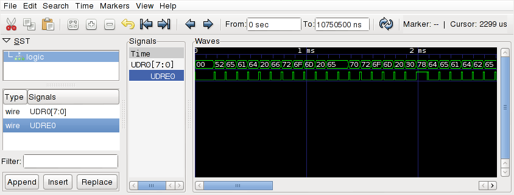
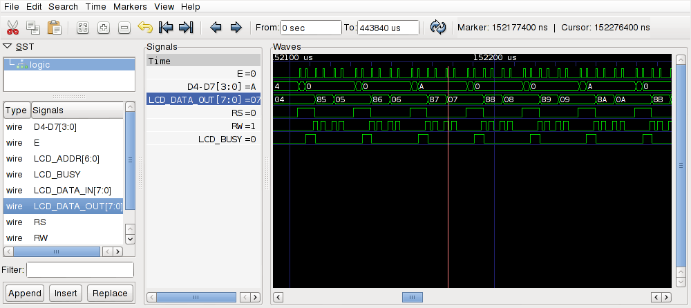

simavr - a lean and mean Atmel AVR simulator for linux
======

_simavr_ is an AVR simulator for linux, or any platform that uses avr-gcc. It uses 
avr-gcc's own register definition to simplify creating new targets for supported AVR
devices. The core was made to be small and compact, and hackable so allow quick 
prototyping of an AVR project. The AVR core is now stable for use with parts 
with <= 128KB flash, and with preliminary support for the bigger parts. The 
simulator loads ELF files directly, and there is even a way to specify simulation 
parameters directly in the emulated code using an .elf section. You can also 
load multipart HEX files.

```diff
- _simavr_ is provided **AS IS**. If you think you should report "security vulnerabilities"
- and waste everyones time with them, you are either a grifter OR an idiot, or both. And
- anyone checking the CV you brag about it will see this paragraph, first.
```

Installation
------------
On OSX, we recommend using [homebrew](https://brew.sh):

    brew tap osx-cross/avr
    brew install --HEAD simavr

On Ubuntu, SimAVR is available in the Bionic package source:

    apt-get install simavr

(Note that the command is made available under the name `simavr` not `run_avr`.)

Otherwise, `make` is enough to just start using __bin/simavr__. To install the __simavr__ command system-wide, `make install RELEASE=1`.

Supported IOs
--------------
* _eeprom_
* _watchdog_
* _IO ports_ (including pin interrupts)
* _Timers_, 8 &16 (Normal, CTC and Fast PWM, the overflow interrupt too)
* The _UART_, including tx & rx interrupts (there is a loopback/local echo test mode too)
* _SPI_, master/slave including the interrupt
* _i2c_ Master & Slave
* External _Interrupts_, INT0 and so on.
* _ADC_
* Self-programming (ie bootloaders!)
* A lot more!

Emulated Cores (very easy to add new ones!)
--------------
+ ATMega2560
+ AT90USB162 (with USB!)
+ ATMega1281
+ ATMega1280
+ ATMega128
+ ATMega128rf1
+ ATMega16M1
+ ATMega169
+ ATMega162
+ ATMega164/324/644
+ ATMega48/88/168/328
+ ATMega8/16/32
+ ATTiny25/45/85
+ ATTIny44/84
+ ATTiny2313/2313v
+ ATTiny13/13a
+ Many more!

Extras:
-------
* fully working _gdb_ support including some pretty cool “passive modes”.
* There is also very easy support for “VCD” (Value Change Dump) that can be visualized 
graphically as “waveforms” with tools like _gtkwave_ (see below).
* You can even source your own VCD files (for example from your logic analyzer) and feed them into your simulation.
* There are a few examples of real life firmwares running on simavr, including OpenGL rendering of the display…
* There is support for _Arduino_, but no IDE integration

Documentation And Further Information
-------------------------------------

* [Manual / Developer Guide](doc/manual/manual.pdf?raw=true)
* [Examples](examples)
* [Mailing List](https://groups.google.com/g/simavr)
* IRC: _#simavr_ on Freenode

Contributing
------------

Patches are always welcome! Please submit your changes via Github pull requests.

VCD Support -- built in logic analyzer 
-----------
_simavr_ can output most of its pins, firmware variables, interrupts and a few other
things as signals to be dumped into a file that can be plotted using gtkwave for
further, precise analysis.
A firmware can contain instructions for _simavr_ to know what to trace, and the file is
automatically generated.
Example:

	const struct avr_mmcu_vcd_trace_t _mytrace[]  _MMCU_ = {
		{ AVR_MCU_VCD_SYMBOL("UDR0"), .what = (void*)&UDR0, },
		{ AVR_MCU_VCD_SYMBOL("UDRE0"), .mask = (1 << UDRE0), .what = (void*)&UCSR0A, },
	};

Will tell _simavr_ to generate a trace everytime the UDR0 register changes and everytime
the interrupt is raised (in UCSR0A). The *_MMCU_* tag tells gcc that it needs compiling,
but it won't be linked in your program, so it takes literally zero bytes, this is a code
section that is private to _simavr_, it's free!
A program running with these instructions and writing to the serial port will generate
a file that will display:

	$ ./simavr/run_avr tests/atmega88_example.axf
	AVR_MMCU_TAG_VCD_TRACE 00c6:00 - UDR0
	AVR_MMCU_TAG_VCD_TRACE 00c0:20 - UDRE0
	Loaded 1780 .text
	Loaded 114 .data
	Loaded 4 .eeprom
	Starting atmega88 - flashend 1fff ramend 04ff e2end 01ff
	atmega88 init
	avr_eeprom_ioctl: AVR_IOCTL_EEPROM_SET Loaded 4 at offset 0
	Creating VCD trace file 'gtkwave_trace.vcd'
	Read from eeprom 0xdeadbeef -- should be 0xdeadbeef..
	Read from eeprom 0xcafef00d -- should be 0xcafef00d..
	simavr: sleeping with interrupts off, quitting gracefully

And when the file is loaded in gtkwave, you see:


You get a very precise timing breakdown of any change that you add to the trace, down
to the AVR cycle. 

Example:
--------
_simavr_ is really made to be the center for emulating your own AVR projects, not just
a debugger, but also the emulating the peripherals you will use in your firmware, so 
you can test and develop offline, and now and then try it on the hardware.

You can also use _simavr_ to do test units on your shipping firmware to validate it
before you ship a new version, to prevent regressions or mistakes.

_simavr_ has a few 'complete projects/ that demonstrate this, most of them were made
using real hardware at some point, and the firmware binary is _exactly_ the one that
ran on the hardware. The key here is to emulate the _parts_ or peripherals that
are hooked to the AVR. Of course, you don't have to emulate the full hardware, you just
need to generate the proper stimulus so that the AVR is fooled.

HD44780 LCD Board Demo
----------------------


This example board hooks up an Atmega48 to an emulated HD44780 LCD and display a running
counter in the 'lcd'. Everything is emulated, the firmware runs exactly like this
on a real hardware.



And this is a gtkwave trace of what the firmware is doing. You can zoom in, measure, etc
in gtkwave, select traces to see etc.

Quite a few other examples are available!
